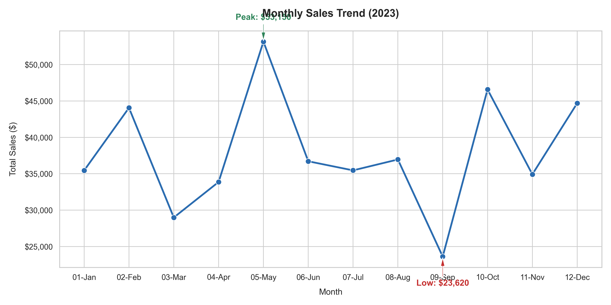
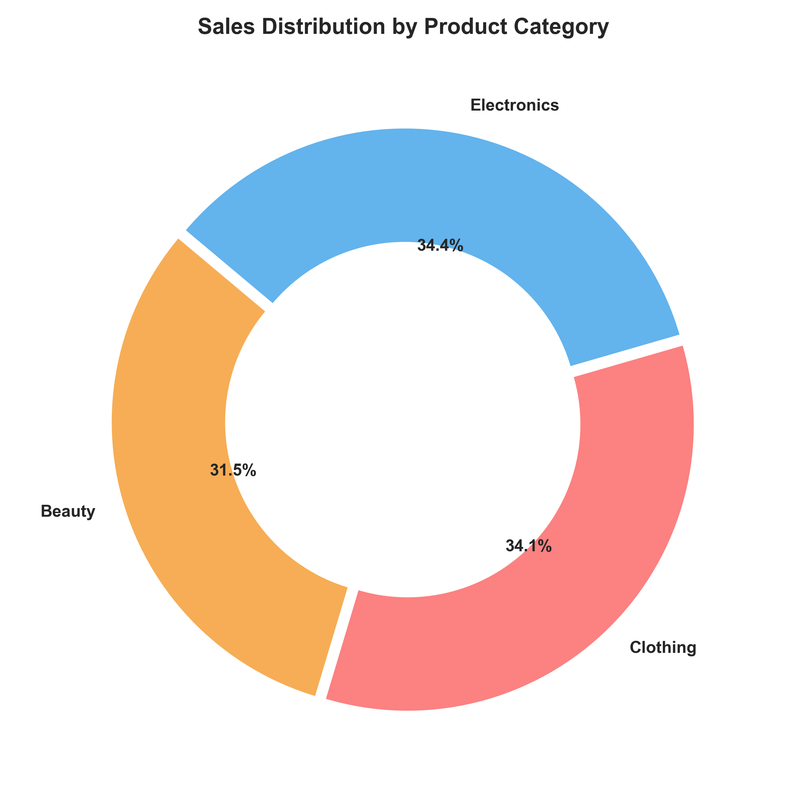
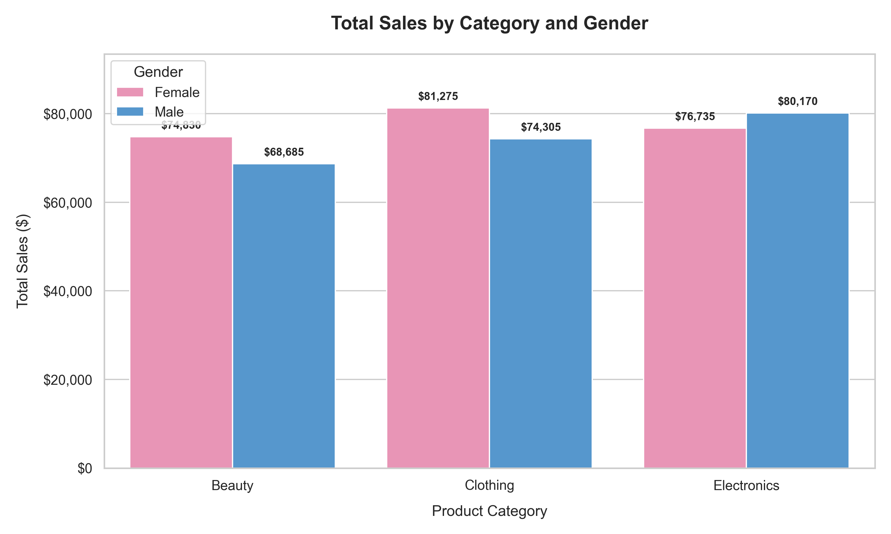
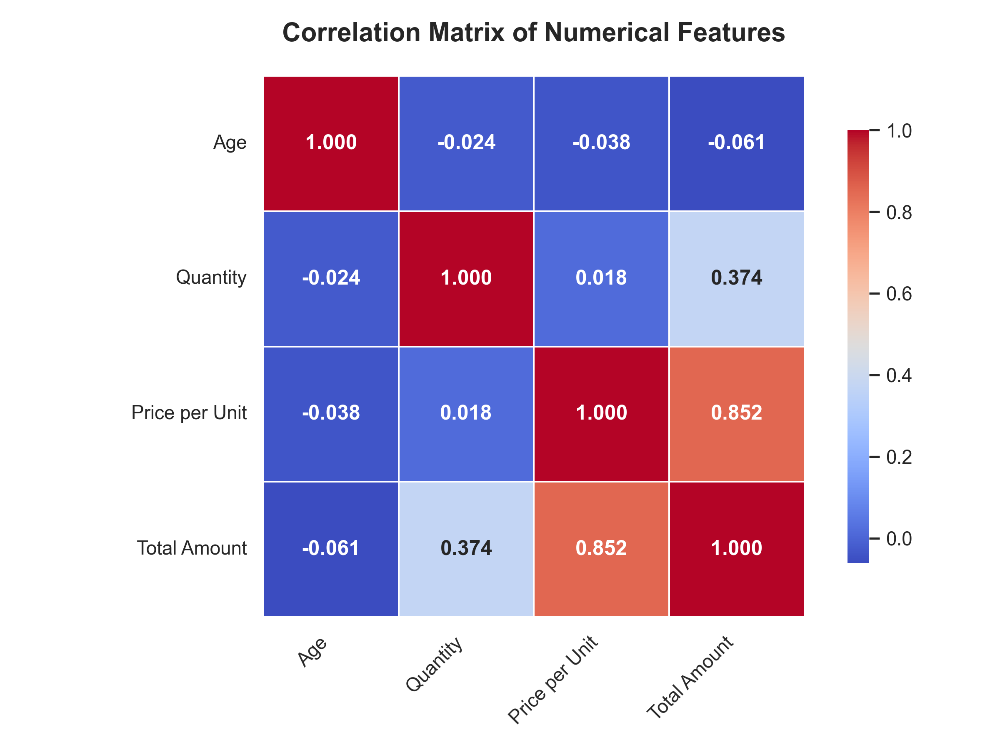

# Retail Sales Exploratory Data Analysis (EDA) Report
**Oasis Infobyte Data Analytics Internship - Project 1**  
**Author:** Aditya Halder (Data Analytics Intern)  
**Date:** June 2026  

---

## 1. Introduction
Exploratory Data Analysis (EDA) is a critical first step in the data science lifecycle. It involves inspecting, cleaning, transforming, and visualizing raw data to discover hidden patterns, identify anomalies, test hypotheses, and verify assumptions using statistical summaries and graphical representations.

This project focuses on analyzing a transaction history dataset from a retail store. The primary objectives are to:
- Clean and preprocess raw transactional records.
- Understand transaction frequency, pricing limits, and quantity patterns.
- Analyze seasonal sales trends over time to identify high and low business cycles.
- Investigate consumer purchasing habits based on gender and age cohorts.
- Evaluate individual product category performances to optimize stock levels and store merchandising.
- Extract data-driven business recommendations to support revenue growth and customer retention.

---

## 2. Dataset Overview
The dataset contains transaction-level historical sales records for a retail shop. It comprises **1,000 records** and **9 attributes** tracking demographics, dates, categories, and financials.

### Attribute Descriptions:
| Column Name | Data Type | Description |
| :--- | :--- | :--- |
| **Transaction ID** | Integer | Unique identifier for each sales transaction |
| **Date** | Object (Date) | The calendar date of the purchase (formatted as YYYY-MM-DD) |
| **Customer ID** | Object (String) | Unique identifier representing an individual customer |
| **Gender** | Object (Categorical)| Customer's gender identity (Male / Female) |
| **Age** | Integer | Customer's age in years (ranging from 18 to 64) |
| **Product Category**| Object (Categorical)| Broad category of product purchased (Beauty / Clothing / Electronics) |
| **Quantity** | Integer | Total items purchased in the transaction (ranging from 1 to 4) |
| **Price per Unit** | Integer | The price of a single unit of the product ($25, $30, $50, $300, $500) |
| **Total Amount** | Integer | The transaction's total value ($) — calculated as `Quantity` * `Price per Unit` |

---

## 3. Data Cleaning and Preprocessing
To guarantee analytical accuracy, the dataset underwent several verification steps:
1. **Missing Value Check**: Checked for null values across all columns. No missing or null values were identified.
2. **Duplicate Row Check**: Scanned the data for duplicate transaction rows. No duplicate records exist.
3. **Data Type Correction**: The `Date` column was converted from a string (`object`) type to a pandas `datetime64[ns]` format. This allows for resampling, extraction of year, month, and day names, and chronological ordering.
4. **Calculational Consistency Check**: Verified that `Total Amount` equals `Quantity` * `Price per Unit` for all 1,000 observations. The verification confirmed 100% mathematical alignment across the dataset.

---

## 4. EDA Findings

### A. Descriptive Statistics
Key numerical observations from the descriptive statistics:
- **Customer Age**: Ranges from **18 to 64 years**, with a mean age of **41.39 years**, showing a mature customer base. The age distribution is relatively flat, indicating even market appeal across adults.
- **Product Quantity**: Customers purchase between **1 and 4 items** per transaction, averaging **2.51 items**.
- **Unit Prices**: Highly discrete pricing tiers ($25, $30, $50, $300, $500), averaging **$179.89** per item.
- **Total Spent**: Transaction amounts range from **$25 to $2,000**, with a mean transaction value of **$456.00** and a median of **$135.00**. The large difference between median and mean highlights a right-skewed distribution driven by high-value transactions (such as 4 items at $500 each).

### B. Time Series and Trend Analysis
- In 2023, the retail store generated **$456,000** in total revenue.
- The monthly sales analysis reveals significant seasonal volatility:
  - **Highest Revenue Months**: **May 2023 ($53,150)** and **October 2023 ($46,580)**.
  - **Lowest Revenue Month**: **September 2023 ($23,620)**. This drop represents a **55.5% decrease** compared to the May peak.
  - **Other Key Months**: Spring (March-May) shows a upward growth pattern, while late summer (August-September) shows a sharp decline.

### C. Category Performance
The store trades in three product categories:
- **Electronics**: Generated the highest total revenue (**$156,905**) across 342 transactions (849 units sold). This performance is led by higher average item values.
- **Clothing**: Driven by transaction frequency, bringing in **351 transactions** (894 units sold) and generating **$155,580** in revenue.
- **Beauty**: Contribution is slightly lower with **$143,515** in revenue, spanning 307 transactions (771 units sold).

### D. Demographic Breakdown
- **Gender Analysis**: 
  - **Female** customers contributed **$232,840** (51.1%) of total revenue across 510 transactions.
  - **Male** customers contributed **$223,160** (48.9%) across 490 transactions.
  - The average transaction value between genders is nearly identical: **$456.55** for females and **$455.43** for males.
- **Gender vs. Product Preference**:
  - Females are the dominant buyers of **Beauty** products, spending **$83,860** (compared to $59,655 by males).
  - Males spend more on **Electronics**, generating **$84,650** (compared to $72,255 by females).
  - Spending on **Clothing** is balanced between genders ($76,725 for females vs. $78,855 for males).
- **Age Analysis**:
  - The **46-55** age group is our largest contributor in terms of sheer revenue (**$97,235**) and transaction count (**225**).
  - The **18-25** age bracket is the smallest cohort (149 transactions) but has the highest average transaction value (**$501.01**).

---

## 5. Visualizations
The visual charts generated during this project are saved under the `Visualizations` directory.

### Chart 1: Monthly Sales Trend (2023)
*Visualizes monthly revenue fluctuations, highlighting the seasonal high and low periods.*

### Chart 2: Product Category Sales Share
*Donut chart depicting the relative revenue share contribution of the three product categories.*

### Chart 3: Category Performance by Gender
*Grouped bar chart displaying how male and female spending compares across product types.*

### Chart 4: Correlation Heatmap of Numerical Features
*A correlation matrix illustrating the relationships between Age, Quantity, Price, and Total Amount.*

---

## 6. Key Insights and Business Recommendations

1. **Leverage Seasonal Trends**:
   - *Insight*: Sales peak in May and October, but slump severely in September and March.
   - *Recommendation*: Introduce a major clearance sale or "Back to School" promotion in late August/early September to mitigate the seasonal dip. Run promotional campaigns ahead of May and October to maximize high-buying interest.
2. **Optimize Marketing by Category and Gender**:
   - *Insight*: Females spent 40% more on Beauty than males, while males spent 17% more on Electronics.
   - *Recommendation*: Target digital advertisements for newly launched Beauty collections primarily at female demographics, and target Electronics promotions (gaming consoles, smart home gadgets) at male customer segments. Cross-promote clothing, as it has uniform interest.
3. **Capture the Youth Market**:
   - *Insight*: Customers aged 18-25 represent the highest average spend per transaction ($501.01).
   - *Recommendation*: Since young shoppers purchase higher-priced items per visit, roll out visual merchandising displays, social media campaigns, and college discounts to convert high-margin items to this segment.
4. **Nurture Loyal Cohorts**:
   - *Insight*: Customers aged 46-55 generate the highest overall transaction count and aggregate revenue.
   - *Recommendation*: Implement a loyalty or subscription program aimed at older shoppers to maintain stable purchasing rates.
5. **Item Bundling to Increase Quantity**:
   - *Insight*: The average quantity sold is 2.51. Correlation analysis confirms that transaction total is highly driven by item price rather than high volume.
   - *Recommendation*: Offer multi-buy discounts (e.g., "Buy 2 Get 1 Free" or "Bundle and Save") on Clothing and Beauty products to push the average quantity per ticket from 2.5 to 3.5.

---

## 7. Conclusion
This retail sales dataset shows a healthy, balanced business profile. The store has stable demand across genders, and three robust core categories (Electronics, Clothing, and Beauty) that split the revenue share almost equally (~34%, ~34%, and ~31% respectively). 

By acting on the seasonal peaks, adapting gender-targeted promotions for product categories, and introducing item bundles, the retail store is well-positioned to stabilize seasonal sales volatility and expand its overall margins. The clean, preprocessed data structure and successful visual exploration in the project lay a firm foundation for future predictive modeling (such as customer segmentation, lifetime value forecasting, or inventory replenishment optimization).
