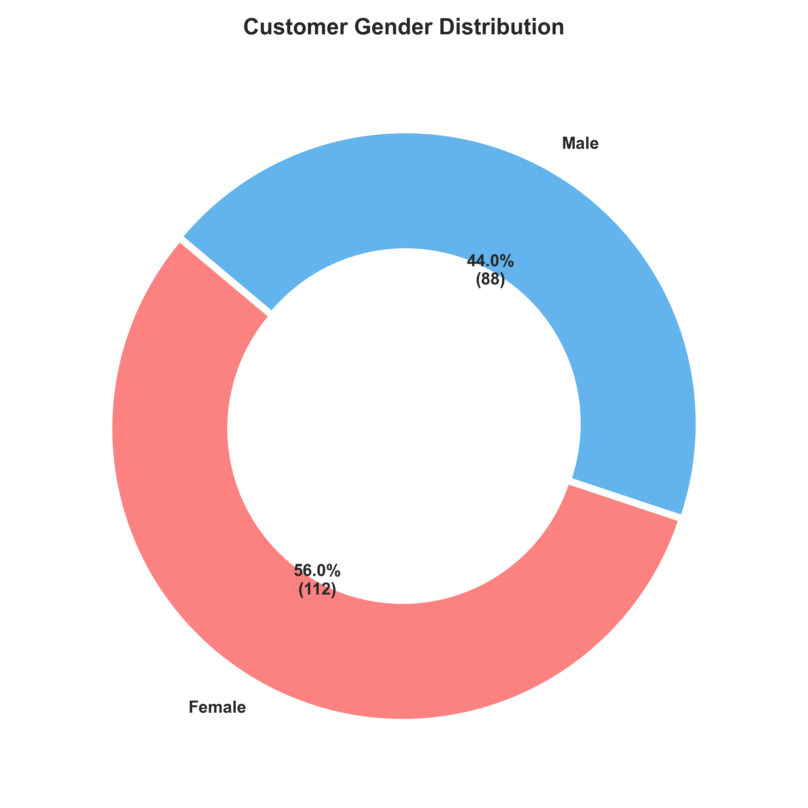
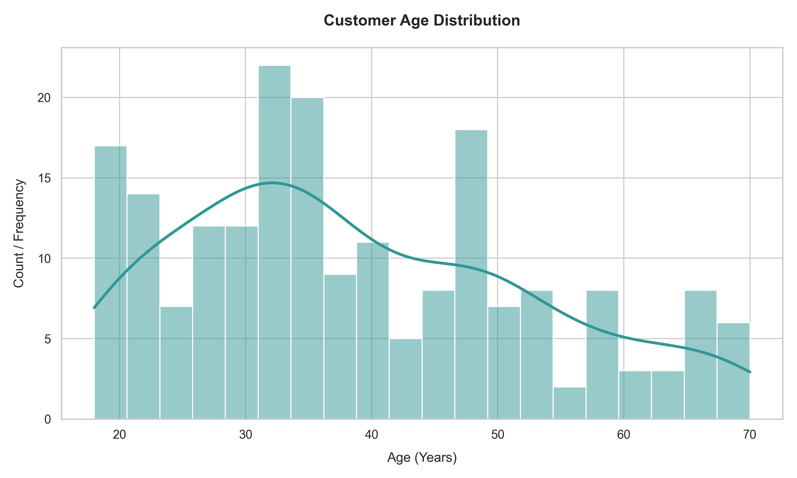
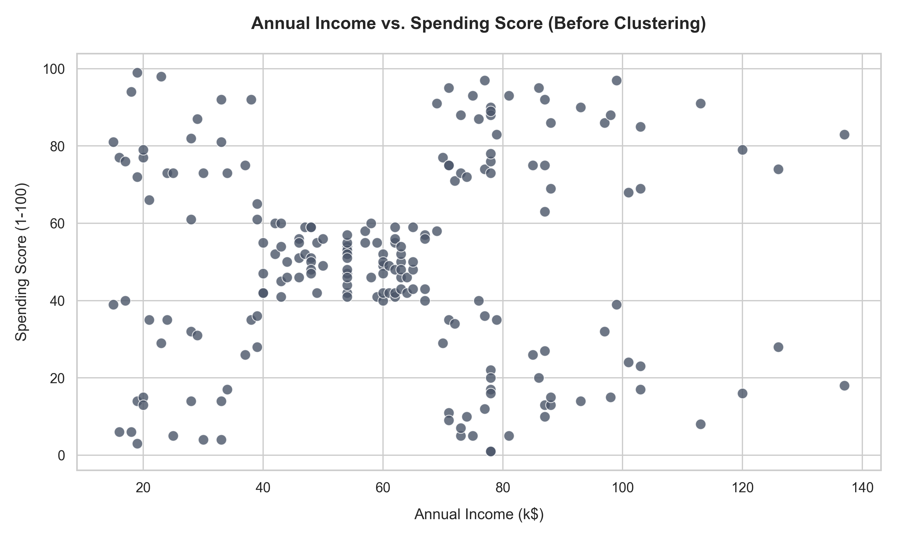
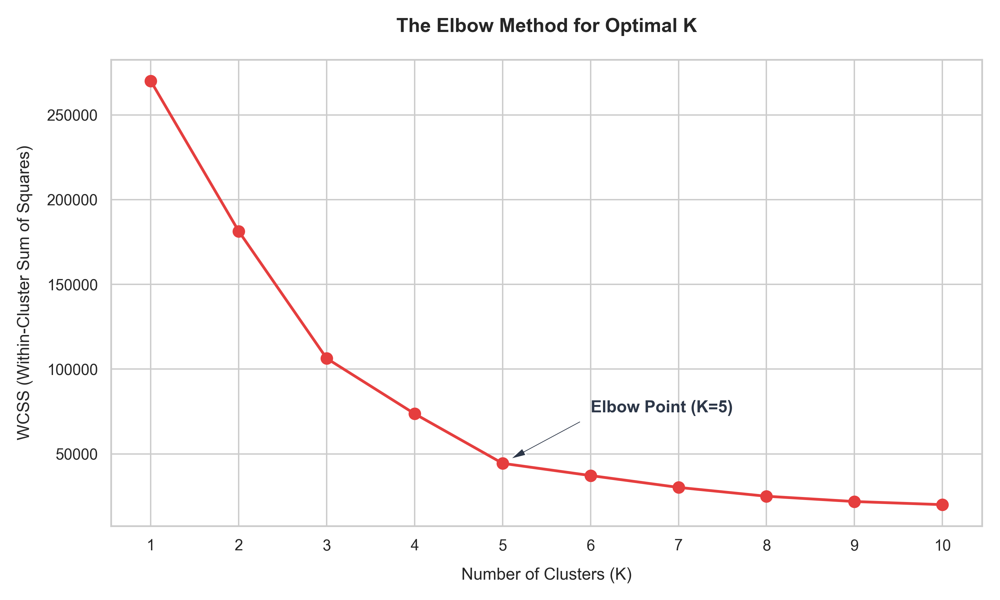
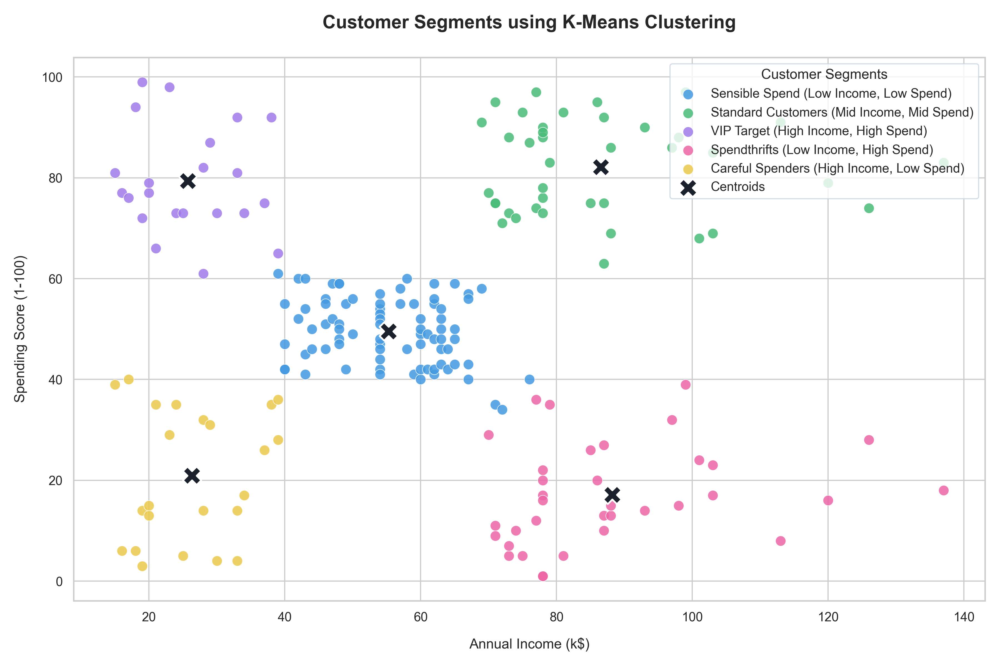

# Customer Segmentation Analysis Report
**Oasis Infobyte Data Analytics Internship - Project 2**  
**Author:** Aditya Halder (Data Analytics Intern)  
**Date:** June 2026  

---

## 1. Introduction
In competitive retail and e-commerce markets, a "one-size-fits-all" marketing strategy is no longer effective. Customer base heterogeneity requires businesses to understand their consumers' distinct buying habits, preferences, and financial capabilities. Customer segmentation is the process of partitioning a customer base into groups of individuals who share similar behaviors, attributes, and purchase patterns.

This report details a complete data analysis project that segments customers of a shopping mall using unsupervised machine learning. By utilizing the **K-Means Clustering** algorithm, we analyze customer profiles based on their annual income and spending score, identifying key buyer personas to guide targeted advertising, optimize inventory, and enhance profitability.

---

## 2. Business Problem
The target retail mall aims to optimize its marketing budget and increase sales conversion rates. Currently, campaigns are sent uniformly to all customers, resulting in high advertising spend and low engagement rates. 

The primary business goals of this segmentation analysis are:
- Identify and profile distinct customer clusters within the consumer base.
- Understand the relationship between customer age, gender, annual income, and spending scores.
- Determine which segment represents the highest revenue potential (the "VIP target" group).
- Uncover segments with high purchasing power but low engagement to design re-engagement campaigns.
- Provide tailored strategies for each segment to improve customer satisfaction and increase customer lifetime value (LTV).

---

## 3. Dataset Overview
The analysis is based on the **Mall Customers Dataset**, containing **200 customer profiles** with **5 attributes**:

- **CustomerID**: Unique identifier for each shopper (1 to 200).
- **Gender**: Categorical demographic identifier (Male / Female).
- **Age**: Customer's age in years (ranges from 18 to 70).
- **Annual Income (k$)**: The customer's approximate yearly earnings (ranges from $15,000 to $137,000).
- **Spending Score (1-100)**: A value assigned by the mall based on customer behavior, frequency, and total purchasing volume (ranges from 1 to 99).

### Descriptive Statistics of Numerical Variables:
| Metric | Customer Age (Years) | Annual Income (k$) | Spending Score (1-100) |
| :--- | :---: | :---: | :---: |
| **Count** | 200 | 200 | 200 |
| **Mean** | 38.85 | 60.56 | 50.20 |
| **Std Dev** | 13.97 | 26.26 | 25.82 |
| **Minimum** | 18.00 | 15.00 | 1.00 |
| **25th Percentile** | 28.75 | 41.50 | 34.75 |
| **Median (50%)** | 36.00 | 61.50 | 50.00 |
| **75th Percentile** | 49.00 | 78.00 | 73.00 |
| **Maximum** | 70.00 | 137.00 | 99.00 |

---

## 4. Data Cleaning
Before running the clustering model, the dataset was inspected for quality:
1. **Missing Values**: All columns were verified to have 200 non-null values. No missing values exist.
2. **Duplicate Records**: The dataset was checked for duplicate customer entries. No duplicate records were found.
3. **Data Types**: All attributes (CustomerID, Age, Income, Spending Score) are stored as integers, and Gender is stored as a string object. No type casting was necessary.

---

## 5. Exploratory Data Analysis (EDA)
- **Gender Breakdown**: Females represent the majority of the customer base, comprising **56%** (112 customers) compared to **44%** (88 customers) for males.
- **Age Profile**: The customer base spans young adults to senior citizens (18-70 years), with a mean age of **38.85 years**. The largest density of shoppers is concentrated between **20 and 45 years**.
- **Income and Spend Correlation**: Plotting Annual Income against Spending Score reveals distinct spatial clusters of customers (low income/low spend, high income/high spend, etc.), highlighting K-Means as an ideal clustering method.

---

## 6. K-Means Clustering & The Elbow Method
K-Means is a centroid-based unsupervised clustering algorithm. It groups data points by minimizing the distance between points and their respective cluster centers. 

To determine the optimal number of clusters ($K$), we implemented the **Elbow Method**. We calculated the **Within-Cluster Sum of Squares (WCSS)** (inertia) for $K = 1$ to $K = 10$:

$$\text{WCSS} = \sum_{i=1}^{K} \sum_{x \in C_i} ||x - \mu_i||^2$$

Where $C_i$ represents cluster $i$ and $\mu_i$ is its centroid.

### WCSS Decreasing Trend:
*   $K = 1$: WCSS = 269,981.28
*   $K = 2$: WCSS = 181,363.60
*   $K = 3$: WCSS = 106,348.37
*   $K = 4$: WCSS = 73,679.79
*   **$K = 5$: WCSS = 44,448.46** (Elbow Point)
*   $K = 6$: WCSS = 37,233.81
*   $K = 7$: WCSS = 30,241.34

The slope of the curve flattens significantly after **$K = 5$**, indicating that adding more clusters does not yield a substantial reduction in WCSS. Thus, **5 clusters** was selected as the optimal model parameter.

---

## 7. Customer Segment Insights
By training our K-Means model with $K=5$, we uncovered 5 distinct customer personas:

### Cluster Profiles & Personas Table:
| Cluster ID | Segment Name | Customer Count | Avg Age | Avg Income (k$) | Avg Spending Score | Gender Breakdown | Target Strategy |
| :---: | :--- | :---: | :---: | :---: | :---: | :--- | :--- |
| **0** | **Standard / Middle Class** | 81 (40.5%) | 42.72 | $55.30k | 49.52 | 48 Female / 33 Male | Standard retention, general discounts. |
| **1** | **VIP Target Segment** | 39 (19.5%) | 32.69 | $86.54k | 82.13 | 21 Female / 18 Male | Exclusive rewards, premium memberships. |
| **2** | **Spendthrifts** | 22 (11.0%) | 25.27 | $25.73k | 79.36 | 13 Female / 9 Male | Trend-based promotions, impulse buys. |
| **3** | **Careful Spenders** | 35 (17.5%) | 41.11 | $88.20k | 17.11 | 16 Female / 19 Male | Direct sales emphasizing value & utility. |
| **4** | **Sensible / Budget Buyers** | 23 (11.5%) | 45.22 | $26.30k | 20.91 | 14 Female / 9 Male | High discounts, basic necessity bundling. |

---

## 8. Visualizations
The visual charts generated during this project are saved under the `Visualizations` directory.

### Chart 1: Customer Gender Distribution
*Donut chart showing a 56% Female majority in the customer base.*

### Chart 2: Customer Age Distribution
*Histogram showing the concentration of shoppers in their late 20s and 30s.*

### Chart 3: Annual Income vs. Spending Score
*Initial scatter plot representing customer relationships before clustering.*

### Chart 4: The Elbow Curve
*WCSS line graph illustrating the selection of optimal K=5 clusters.*

### Chart 5: Final Customer Clusters
*Clustered scatter plot showcasing the 5 customer segments and their centroids.*

---

## 9. Conclusion & Business Recommendations

1. **Focus on the VIP Target Segment (Cluster 1)**:
   - This group represents **19.5%** of the mall's customer base. They are young (average age 32.7) and have high earnings ($86.54k) coupled with high spending (score 82.1).
   - *Recommendation*: Implement high-tier loyalty programs, private preview sales, premium customer service, and direct mobile advertisements for new luxury product releases.
2. **Convert Careful Spenders (Cluster 3)**:
   - Representing **17.5%** of the customer base, these shoppers have high incomes ($88.20k) but low spending scores (17.1).
   - *Recommendation*: Since they have purchasing power but choose not to spend, target them with benefit-driven marketing campaigns (focusing on durability, reviews, and high utilities), bundle offers, and personalized discount codes for premium items.
3. **Engage the Young Spendthrifts (Cluster 2)**:
   - This youngest group (average age 25.3) has low income ($25.73k) but a very high spending score (79.4).
   - *Recommendation*: Use visual, trend-centric social media marketing, pop-up events, and flexible payment options (e.g. "Buy Now Pay Later") to drive sales volume.
4. **Stable Care for Standard Customers (Cluster 0)**:
   - The largest single segment (**40.5%** of the customer base) represents middle-aged shoppers with average income ($55.30k) and average spending (49.5).
   - *Recommendation*: Maintain stable engagement using standard store promotions, cashbacks on daily purchases, and holiday discount codes.
