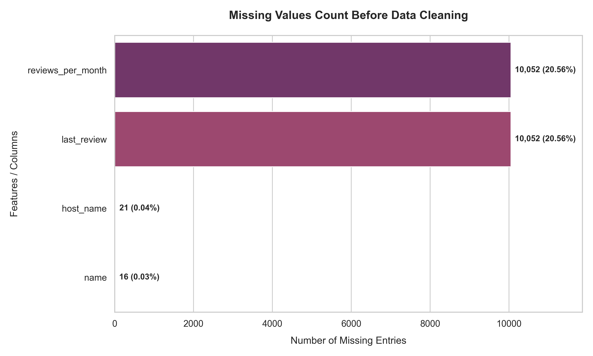
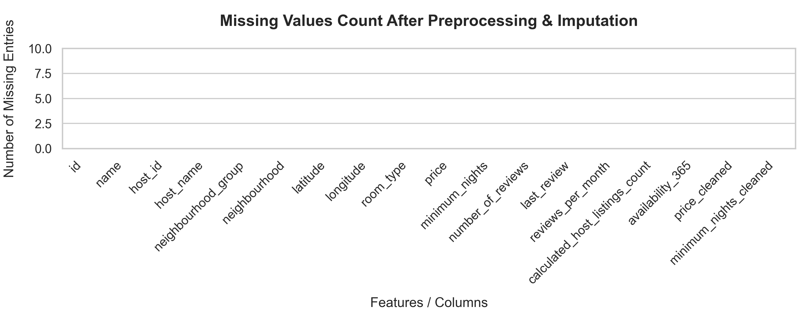
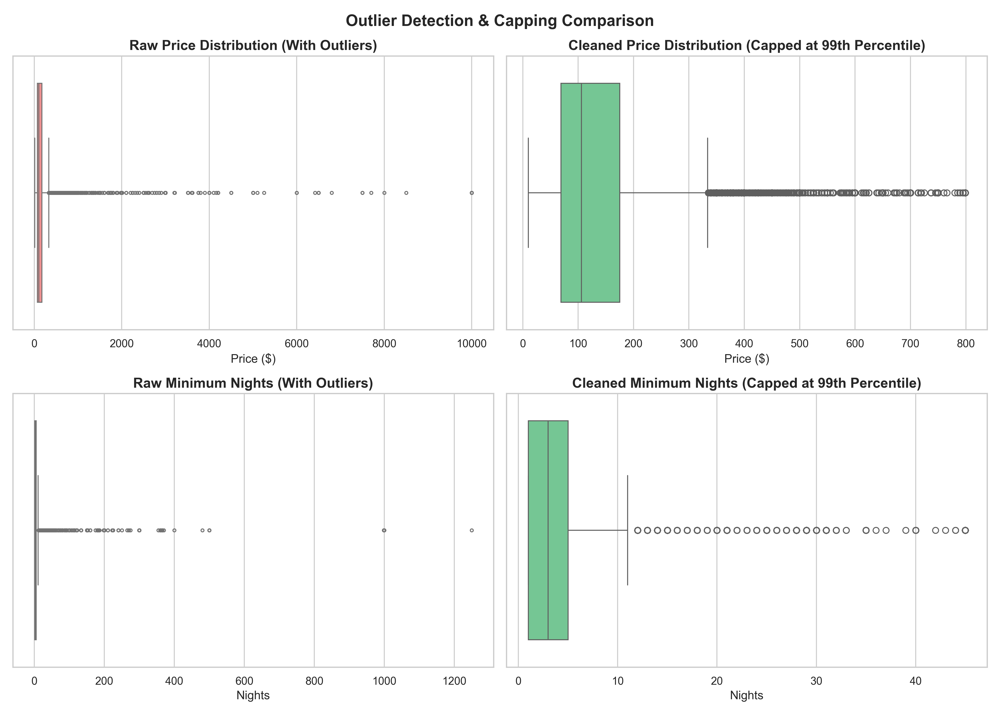
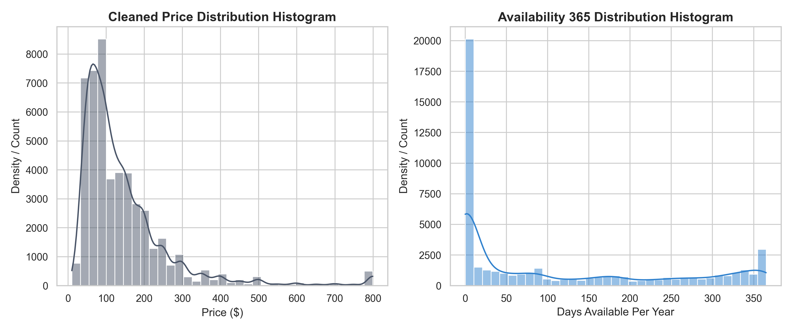
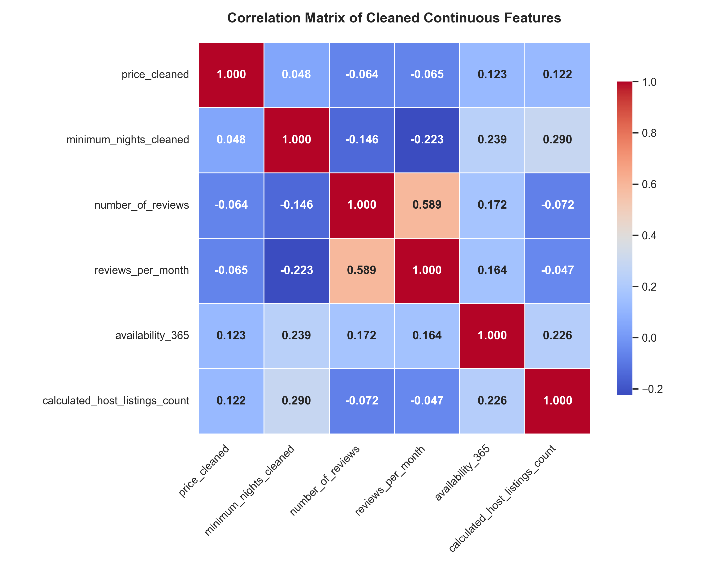

# Data Cleaning and Preprocessing Report
**Oasis Infobyte Data Analytics Internship - Project 3**  
**Author:** Aditya Halder (Data Analytics Intern)  
**Date:** June 2026  

---

## 1. Introduction
Real-world datasets are rarely collected in clean, model-ready forms. They are commonly riddled with missing values, duplicate transactions, formatting errors, invalid data types, and extreme outliers. Data cleaning is the cornerstone of data science, as data quality directly limits the accuracy of predictive algorithms and analytical summaries.

This report summarizes a complete data cleaning and preprocessing project executed on the **New York City Airbnb Open Data (2019)** dataset. The objective is to construct a production-ready, standardized preprocessing pipeline that takes raw transactional records and outputs a clean, scaled, and encoded dataset optimized for downstream machine learning.

---

## 2. Business Problem
Airbnb listings feature high variability. Hosts name their listings freely, set their own pricing thresholds, and determine booking availability. This freedom introduces a high volume of noise, errors, and outliers:
- Missing host details or reviews skew customer trust indicators.
- Listings with $0 pricing represent database bugs or promotions that distort average revenue metrics.
- Outliers (such as pricing a single room at $10,000/night or setting a minimum stay of 3.4 years) heavily skew sample means, causing traditional models to overfit.
- Categorical descriptions (like Borough Groups and Room Types) cannot be directly processed by algebraic estimators (e.g. Linear Regression, SVM) without encoding.
- Differences in numerical scales (e.g., price ranging in hundreds, while availability ranges from 0 to 365) cause distance-based algorithms (like KNN, K-Means) to focus disproportionately on larger-scaled variables.

Our goal is to build a robust preprocessing pipeline to clean, filter, encode, and scale this raw data to ensure its business utility and predictive integrity.

---

## 3. Dataset Overview
The analysis is based on the **New York City Airbnb 2019 dataset**, consisting of **48,895 records** and **16 attributes**:

- **id**: Unique sequential listing identifier.
- **name**: Descriptive listing text (e.g. "Clean & quiet apt").
- **host_id**: Unique host account identifier.
- **host_name**: First name of the host.
- **neighbourhood_group**: High-level geographic borough (Manhattan, Brooklyn, Queens, Bronx, Staten Island).
- **neighbourhood**: The local neighbourhood boundary.
- **latitude / longitude**: Geographical coordinates.
- **room_type**: Booking room description (Entire home/apt, Private room, Shared room).
- **price**: Rental price per night ($).
- **minimum_nights**: Minimum stay volume required.
- **number_of_reviews**: Total reviews left by guests.
- **last_review**: Date of the latest review (parsed as string date).
- **reviews_per_month**: Average number of reviews written monthly.
- **calculated_host_listings_count**: Total listings managed by the host.
- **availability_365**: Days the listing is available for booking per year.

---

## 4. Data Cleaning Details

### A. Missing Values Imputation
A scan of the dataset revealed missing values in four attributes:
- **name** (16 missing) & **host_name** (21 missing): Text descriptions. We imputed these with `'Unknown'` to preserve the row records while acknowledging the missing data.
- **reviews_per_month** (10,052 missing): Occurs when a listing has `number_of_reviews` = 0. Imputed with `0.0`.
- **last_review** (10,052 missing): Represents listings with 0 reviews. We converted this attribute to a datetime format and filled NaT records with a sentinel date `'1970-01-01'` to represent "Not Reviewed".

### B. Duplicate Checks
We scanned the data for identical listing rows. **0 duplicate records** were detected, confirming transaction uniqueness.

### C. Filtering Invalid Values
We checked the `price` column for entries $\le 0$. We identified **11 listings** with `price = $0`, which represent database logging bugs or invalid profiles. These 11 records were removed.

---

## 5. Outlier Treatment
We analyzed the numerical distributions of `price` and `minimum_nights` to identify anomalies.

### A. Price Outliers:
- **Descriptive Range**: Price ranges from $0 to $10,000 per night, with a mean price of **$152.72** and standard deviation of **$240.15**.
- **IQR Thresholds**: 
  - Q1 (25th percentile) = $69.00
  - Q3 (75th percentile) = $175.00
  - IQR = $106.00
  - Upper IQR Bound = $175 + (1.5 \times 106) = \mathbf{\$334.00}$
  - Lower IQR Bound = $69 - (1.5 \times 106) = -\$90.00$
- **Outliers Count**: Using IQR boundaries, **2,972 price outliers** (6.08%) were detected.
- **Capping Policy**: To avoid losing 6% of our dataset (which represents legitimate premium listings), we applied **99th percentile capping** rather than row deletion. The capping threshold was computed as **$799.00**. Any price above $799 was capped at $799. This reduced the standard deviation of the price column from $240.15 to a stable **$121.93**.

### B. Minimum Nights Outliers:
- **Descriptive Range**: Ranges from 1 night up to 1,250 nights.
- **Capping Policy**: We capped the maximum minimum nights at its **99th percentile**, which is **45.00 nights**. Any minimum stay requirement above 45 nights was capped at 45.

---

## 6. Preprocessing & Encoding

### A. Categorical Encoding
To prepare text variables for machine learning models, we one-hot encoded the categorical columns:
- **neighbourhood_group**: Encoded into dummy variables (Brooklyn, Manhattan, Queens, Staten Island, with Bronx as the baseline).
- **room_type**: Encoded into dummy variables (Private room, Shared room, with Entire home/apt as the baseline).

This expanded our feature columns from 16 to **22 variables**.

### B. Numerical Feature Scaling
Continuous columns (`price_cleaned`, `minimum_nights_cleaned`, `number_of_reviews`, `reviews_per_month`, `availability_365`) have varying numerical scales. We standardized these features using Scikit-Learn's `StandardScaler`, setting their mean to 0 and variance to 1. This prevents high-valued columns (e.g. availability up to 365) from overriding lower-ranged columns (e.g. reviews per month up to 10) in distance-based calculations.

---

## 7. Summary Statistics Before vs. After Cleaning

| Parameter | Raw Dataset | Processed & Preprocessed Dataset |
| :--- | :---: | :---: |
| **Row Count** | 48,895 | 48,884 (11 invalid rows dropped) |
| **Column Count** | 16 | 18 (base df), 22 (final encoded df) |
| **Missing Values** | 10,141 (across 4 columns) | **0 (fully clean)** |
| **Average Price** | $152.72 | **$143.99** |
| **Price Std Dev** | $240.15 | **$121.93** (reduced volatility) |
| **Max Price** | $10,000.00 | **$799.00** (outlier-treated) |
| **Max Minimum Nights** | 1250 | **45.00** (outlier-treated) |

---

## 8. Visualizations
The charts generated are saved inside the `Visualizations/` directory:

### Chart 1: Missing Values Count Before Cleaning
*Identifies the raw count and percentage of missing entries per column.*

### Chart 2: Missing Values Count After Cleaning
*Demonstrates a 100% clean dataset with zero missing values.*

### Chart 3: Outlier Capping Comparisons (Box Plots)
*Shows the box distributions for Price and Minimum Nights before vs. after capping.*

### Chart 4: Cleaned Feature Distributions
*Histograms illustrating the normal distributions of capped price and availability.*

### Chart 5: Correlation Heatmap
*Matrix representing the correlation coefficient values between clean continuous variables.*

---

## 9. Conclusion
The NYC Airbnb dataset has been transformed from a noisy, incomplete state into a clean, scaled, and encoded dataframe. By imputing missing values, removing invalid listings, capping extreme price and night outliers, and scaling features, we have preserved data size while eliminating the skewness that degrades predictive performance. The clean output is stored, validated, and fully prepared for training machine learning algorithms.
